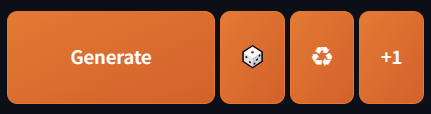
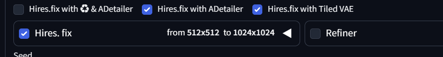

# sd-webui-reuse-seed-plus

[日本語](#日本語) | [English](#english)

# 日本語

# 説明

## 機能付き生成ボタンの追加

- txt2img, img2img の画面に三つの機能付き生成ボタンを追加します。
- 🎲: ランダムに設定される新たなシードで生成します。
- ♻️: 前回生成時のシードがある場合、シードを再利用して生成します。
- +1: シードが設定されている場合、シードに 1 を足して生成します。シードが-1 の場合、このボタンは無効化されます。
  <br><br>
  <p>
  
  </p>
  <br>

## Hires.fix 連動機能

- Hires.fix のオン/オフに連動して他の機能のオン/オフを切り替えます。
- Hires.fix ボタンの上に各機能のチェックボックスが追加されます。
- Hires.fix with ♻️ & ADtailer: チェックボックスがオンの場合、Hires.fix に連動して ♻️ (Reuse seed) と ADtailer を切り替えます。
- Hires.fix with ADtailer: チェックがオンの場合、Hires.fix に連動して ADtailer を切り替えます。
- Hires.fix with ADtailer: チェックボックスがオンの場合、Hires.fix に連動して Tiled VAE を切り替えます。forge では Tiled VAE が本体に内蔵されており自動適用となるため本機能は無視されます。
- ADtailer がインストールされていない場合、 ADtailer の操作は無視されます。
  <br><br>
  <p>
  
  </p>
  <br>

# インストール方法

AUTOMATIC1111 の Extensions タブをクリック、Install from URL タブをクリックし、URL for extension's git repository に以下の url を入力し Install ボタンをクリックしてください。

```
https://github.com/Takenoko3333/sd-webui-reuse-seed-plus.git
```

<br>

# 変更履歴

## [0.2.0] - 2024-6-8

### 追加, 修正

- 機能付き生成ボタン (🎲, ♻️, +1) を追加
- Hires.fix 連動機能に'Hires.fix ADtailer', 'Hires.fix with Tiled VAE'を追加
- 文言を修正

## [0.1.4] - 2024-6-6

### 修正

- チェックボックスの id を修正
- チェックボックスのセレクターを修正

## [0.1.3] - 2024-6-6

### 修正

- 関数を修正

## [0.1.2] - 2024-6-6

### 修正

- css を修正

## [0.1.1] - 2024-6-6

### 修正

- README を修正

## [0.1.0] - 2024-6-6

### 追加

- v0.1.0 リリース
  <br><br>

# ライセンス

Copyright © 2024 Takenoko  
Released under the [MIT License](https://opensource.org/licenses/mit-license.php).
<br><br><br>

# English

# Description

## Adding Functional Generation Buttons

- Three functional generation buttons will be added to the txt2img and img2img screens.
- 🎲: Generates with a new seed set randomly.
- ♻️: Reuses the seed from the previous generation if available.
- +1: Adds 1 to the current seed if a seed is set. If the seed is -1, this button is disabled.
  <br><br>
  <p>
  
  </p>
  <br>

## Hires.fix Integration Feature

- The activation/deactivation of other features will be linked to the Hires.fix toggle.
- Checkboxes for each feature will be added above the Hires.fix button.
- Hires.fix with ♻️ & ADtailer: If the checkbox is on, toggles ♻️ (Reuse seed) and ADtailer in sync with Hires.fix.
- Hires.fix with ADtailer: If the checkbox is on, toggles ADtailer in sync with Hires.fix.
- Hires.fix with Tiled VAE: If the checkbox is on, toggles Tiled VAE in sync with Hires.fix. This function is ignored in forge because Tiled VAE is built into the main unit and is applied automatically.
- If ADtailer is not installed, the ADtailer operation is ignored.
  <br><br>
  <p>
  
  </p>
  <br>

# Installation Instructions

Click on the Extensions tab in AUTOMATIC1111, then click on the Install from URL tab. Enter the following URL in the URL for extension's git repository field and click the Install button.

```
https://github.com/Takenoko3333/sd-webui-reuse-seed-plus.git
```

<br>

# Change Log

## [0.2.0] - 2024-6-8

### Add and Fixed

- Added functional generation buttons (🎲, ♻️, +1)
- Added 'Hires.fix ADtailer' and 'Hires.fix with Tiled VAE' to the Hires.fix integration feature
- Revised text and wording

# Changelog

## [0.1.4] - 2024-6-6

### Fixed

- Fixed chexbox id name
- Fixed chexbox selector

## [0.1.3] - 2024-6-6

### Fixed

- Fixed function

## [0.1.2] - 2024-6-6

### Fixed

- Fixed css

## [0.1.1] - 2024-6-6

### Fixed

- Fixed README

## [0.1.0] - 2024-6-6

### Added

- v0.1.0 release

# License

Copyright © 2024 Takenoko  
Released under the [MIT License](https://opensource.org/licenses/mit-license.php).
