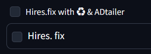

# sd-webui-reuse-seed-plus

[日本語](#日本語) | [English](#english)

# 日本語

# 説明

- Hires.fix 有効化時に Reuse seed と ADtailer を同時に有効化します。
- Hires.fix ボタンの上に Hires.fix with ♻️ & ADtailer のチェックボックスが追加されます。
- Hires.fix with ♻️ & ADtailer のチェックボックスがオンの場合、Hires.fix をオンにした時に Reuse seed と ADtailer を同時に有効化します。Hires.fix をオフにした時は Random seed を有効化し ADtailer をオフにします。
- ADtailer がインストールされていない場合は ADtailer の操作は無視され、Reuse seed(Random seed)のみが連動します。
  <br><br>
  
  <br><br>

# インストール方法

AUTOMATIC1111 の Extensions タブをクリック、Install from URL タブをクリックし、URL for extension's git repository に以下の url を入力し Install ボタンをクリックしてください。

```
https://github.com/Takenoko3333/sd-webui-reuse-seed-plus.git
```

<br>

# 変更履歴

## [0.1.2] - 2024-6-6

### 修正

- css を修正

## [0.1.1] - 2024-6-6

### 修正

- README を修正

## [0.1.0] - 2024-6-6

### 追加

- v0.1.0 リリース
  <br><br>

# ライセンス

Copyright © 2024 Takenoko  
Released under the [MIT License](https://opensource.org/licenses/mit-license.php).
<br><br><br>

# English

# Description

- When Hires.fix is enabled, both Reuse seed and ADtailer are enabled simultaneously.
- A checkbox labeled Hires.fix with ♻️ & ADtailer is added above the Hires.fix button.
- When the Hires.fix with ♻️ & ADtailer checkbox is on, enabling Hires.fix also enables both Reuse seed and ADtailer. When Hires.fix is turned off, Random seed is enabled and ADtailer is turned off.
- If ADtailer is not installed, the ADtailer operation is ignored, and only Reuse seed (Random seed) will be toggled accordingly.
  <br><br>
  
  <br><br>

# Installation method

Click the Extensions tab in AUTOMATIC1111, click the Install from URL tab, enter the following URL in the URL for extension's git repository field, and click the Install button.

```
https://github.com/Takenoko3333/sd-webui-reuse-seed-plus.git
```

<br>

# Changelog

## [0.1.2] - 2024-6-6

### Fixed

- Fixed css

## [0.1.1] - 2024-6-6

### Fixed

- Fixed README

## [0.1.0] - 2024-6-6

### Added

- v0.1.0 release

# License

Copyright © 2024 Takenoko  
Released under the [MIT License](https://opensource.org/licenses/mit-license.php).
